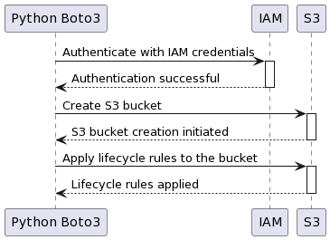
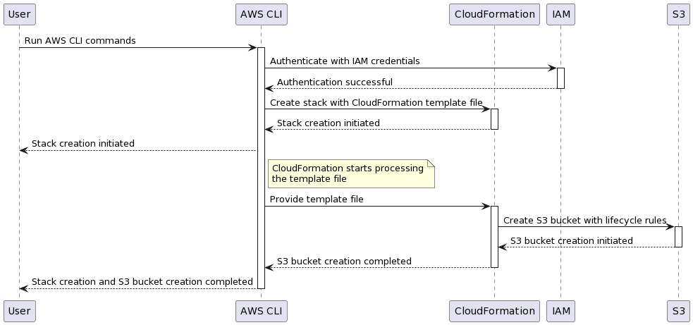

# Create S3 Bucket with Lifecycle Rules

Scripts to create an S3 bucket in AWS and apply Lifecycle rules.

Parameters:

Access Key Id

Secret Access Key

Session Key (set to "None" if using permanent credentials)

## Boto3

A python script.

In the config.json replace MY_BUCKET_BASE_NAME with your preferred prefix.

## CloudFormation

A bash shell script.

In the config.json replace MY_BUCKET_BASE_NAME and MY_STACK_BASE_NAME with your preferred prefixes.

